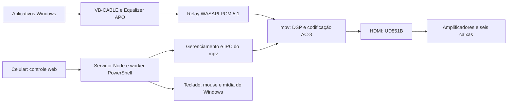

# Sistema 5.1 artesanal

Código desenvolvido para transformar o áudio compartilhado do Windows em Dolby Digital 5.1, corrigir o tempo entre as caixas, ajustar o subwoofer e controlar o PC pelo celular. Este repositório reúne a implementação e o conhecimento para aproveitar os módulos em outro projeto.

**Comece por [Reaproveitar em outro projeto](docs/REAPROVEITAMENTO.md).** Para entender as decisões e limitações, leia [Arquitetura](docs/ARQUITETURA.md) e [Estado e validação](docs/ESTADO-E-VALIDACAO.md).

## O que foi desenvolvido

| Módulo | Responsabilidade | Código principal |
| --- | --- | --- |
| Captura e transporte | WASAPI loopback, PCM 5.1, fila limitada, pool de buffers, alimentação contínua do mpv | [RelayLoopbackLowLatency.cs](configuracao-pc/RelayLoopbackLowLatency.cs) |
| Upmix | Distribuição de mono/estéreo; preservação de conteúdo multicanal conforme o modo selecionado | [StereoUpmix.cs](configuracao-pc/StereoUpmix.cs), [configuração APO](configuracao-pc/upmix-sistema-5.1.txt) |
| Supervisão | Iniciar, parar, detectar HDMI, recuperar falhas e publicar estado | [Controle do sistema 5.1.ps1](configuracao-pc/Controle%20do%20sistema%205.1.ps1), [rodar-audio-sistema.ps1](configuracao-pc/rodar-audio-sistema.ps1) |
| DSP | Atrasos individuais, EQ paramétrico LFE, crossover das surrounds, soma de graves da central, margem e volume mestre | [LFE equalizador comum.ps1](configuracao-pc/LFE%20equalizador%20comum.ps1), [Ajustar atrasos.ps1](configuracao-pc/Ajustar%20atrasos.ps1) |
| Painéis locais | Interface Windows para gerenciamento e equalizador | [Equalizador do sub.ps1](configuracao-pc/Equalizador%20do%20sub.ps1) |
| Controle remoto | Site para celular, autenticação por PIN, mídia Windows, teclado e mouse, Jellyfin e ponte Netflix | [controle-remoto](configuracao-pc/controle-remoto) |
| Netflix 5.1 | Iniciadores com parâmetros do player; ferramenta anterior de preferência local e reversão | [Abrir Netflix 5.1.ps1](configuracao-pc/Abrir%20Netflix%205.1.ps1), [backend anterior](configuracao-pc/netflix-dolby51-automatico) |
| Pesquisa e diagnóstico | Testes sintéticos, inspeção de codecs, fila/deriva, tentativas YouTube e estudo do UD851B | [Documentação local](configuracao-pc/LEIA-ME.md), [pesquisa](pesquisa/viabilidade-firmware-ud851b.md) |

## Dinâmica do sistema



A faixa estéreo pode ser expandida para as seis caixas. Isso não cria os canais independentes de uma gravação 5.1 original. A saída final é AC-3; uma faixa E-AC-3 recebida pela Netflix é decodificada e recodificada após o DSP, não enviada diretamente ao UD851B.

## Calibração exportada

| Canal | Valor solicitado | Valor em 48 kHz |
| --- | ---: | ---: |
| FL / FR | 76,8 ms | 3.686 amostras = 76,792 ms |
| Central | 5,8 ms | 278 amostras = 5,792 ms |
| LFE | 0 ms | 0 amostras |
| SL / SR | 71 ms | 3.408 amostras |

Perfil Fidelidade: **AC-3 640 kbit/s e buffer de saída de 32 ms**. Perfil Estável: **448 kbit/s e 64 ms**. O buffer de saída é somente uma parcela da latência total. O código contém uma compensação de relógio `asetrate=48002` específica da medição deste PC; ela precisa ser recalibrada em outro sistema.

O crossover das surrounds está configurado em 90 Hz. A cópia dos graves da central abaixo de 120 Hz mantém a central com sua faixa completa. O grafo salvo contém essa cópia, mas o preset local exportado tinha `CenterBassEnabled=false`; essa divergência está registrada em [Estado e validação](docs/ESTADO-E-VALIDACAO.md) e deve ser resolvida no projeto de destino.

## Pré-requisitos e instalação

O ambiente de origem usou Windows, Windows PowerShell 5.1/.NET Framework, Node.js **24.14.0**, Python **3.14.3**, mpv, SoundVolumeView, VB-CABLE e Equalizer APO. O servidor Node não exige pacotes npm externos. Consulte [Instalação e dependências](docs/INSTALACAO.md) antes de iniciar os scripts em outro PC.

Os fontes preservam algumas referências ao hardware de origem: GUID do VB-CABLE, busca por `SONY`/`NVIDIA`, caminhos de executáveis e calibração de relógio. **Este é um projeto documentado para migração; não é um instalador universal.** Os binários e drivers são obtidos separadamente.

Os arquivos `.conf` e o exemplo de preset preservam o estado exportado. A configuração ativa e o preset de volume do PC de origem são dados locais ignorados pelo Git. Para inicializar uma cópia isolada dos exemplos:

```powershell
# Execute dentro de uma cópia nova do repositório, antes de rodar o áudio.
powershell.exe -NoProfile -ExecutionPolicy Bypass -File .\scripts\Preparar exemplos locais.ps1
```

## Testes

Testes isolados de painel/servidor e tentativa YouTube:

```powershell
npm test
```

Backend histórico de configuração Netflix, usando bancos temporários:

```powershell
npm run test:netflix
```

Pool/filas do relay, sem abrir dispositivos de áudio:

```powershell
powershell.exe -NoProfile -ExecutionPolicy Bypass -File .\configuracao-pc\testar-relay-pool.ps1
```

Os testes de DSP com mpv, testes nativos com janelas e verificações que alteram a rota ficam separados. [Estado e validação](docs/ESTADO-E-VALIDACAO.md) explica quais são apropriados para cada ambiente.

## Organização para reaproveitamento

```text
configuracao-pc/              implementação, painéis e scripts de diagnóstico
  controle-remoto/            servidor, worker, controle universal e site
  netflix-dolby51-automatico/ backend anterior da preferência local
  youtube-dolby51-extensao/   tentativa experimental, não comprovada em uso real
docs/                        arquitetura, migração, instalação e validação
examples/                    preset e configurações sem credenciais
scripts/                     preparação dos exemplos e verificação do pacote
pesquisa/                    relatório de viabilidade do firmware
```

O diretório mantém os nomes dos arquivos originais para preservar as referências entre scripts. Variantes antigas com nomes `antes-*`, `aplicar-atrasos-*` e `mpv-teste-*` são registros de desenvolvimento: o ponto de entrada atual é `Controle do sistema 5.1.ps1`, que usa `rodar-audio-sistema.ps1` e `RelayLoopbackLowLatency.cs`.

## Arquivos locais e terceiros

A lista de permissões do `.gitignore` publica código, documentos e exemplos. Ela deixa fora PIN, chave da ponte Netflix, cookies, perfis do navegador, logs, PIDs, backups locais, áudio de teste gerado, instaladores, firmware extraído e bibliotecas baixadas. O servidor gera suas próprias credenciais ao ser iniciado em uma cópia nova. [Manifesto de publicação](docs/PUBLICACAO.md) descreve a seleção.

As dependências de terceiros mantêm seus próprios termos de distribuição. Este repositório privado não redistribui seus executáveis nem o player público completo da Netflix.
