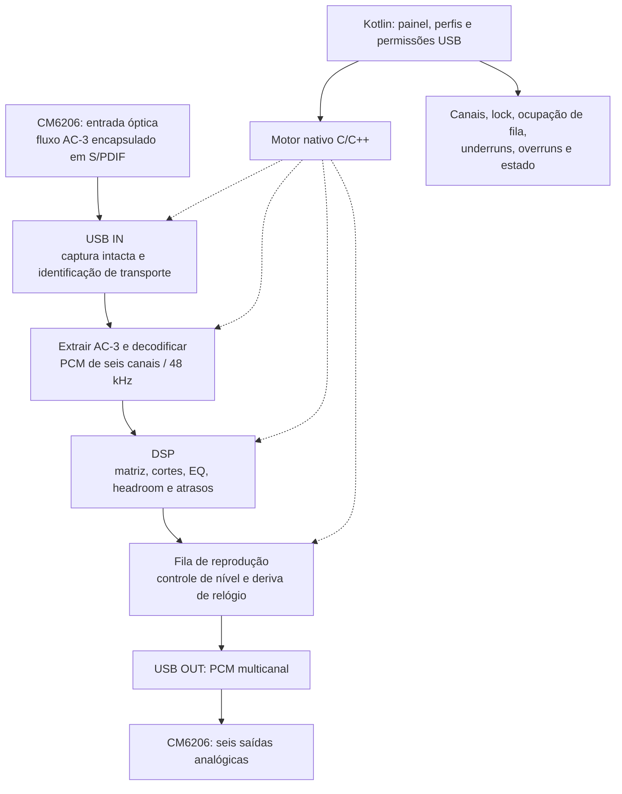

# Desenvolvimento e validação do DSP no Galaxy A34

Plano aprovado em 05/10/2026. A arquitetura e as condições físicas estão em [A34-DSP](A34-DSP.md). Este roteiro é para criar a implementação; nenhuma etapa abaixo deve ser registrada como aprovada por teste sem a respectiva evidência. As [notas complementares](A34-NOTAS-COMPLEMENTARES.md) registram a direção mais recente, decodificação DTS opcional, controle de volume e teste da PC-USB do UD851B.

## Desenvolvimento no PC e execução no telefone

### Situação em 09/10/2026

Atualização **0.5.0**, instalada no SM-A346M/Android 14: crossover frontal/central, subsônico LFE e troca FC/LFE física. Compilação, 25 casos JUnit e lint passaram; instrumentação no telefone protege os seis canais decodificados contra upmix e conserva a ordem lógica no WAV. A nova gestão de graves comparou 431.616 frames com mpv, erro máximo 3,73e-9 e menor SNR 146,92 dB. Esses resultados são de arquivos; ainda faltam HID integrado, captura IEC61937, mapa físico e sessão óptica contínua no telefone. Veja a atualização 0.5.0 no [relatório consolidado](PROGRESSO-A34-E-UPMIX-2026-10-09.md).

O plano passou a ter implementação Java Android em `android-a34/`, incluindo motor DSP, painel, perfis, arquivos AC-3/WAV, serviço PCM USB e diagnósticos. Kotlin/C++/FFmpeg abaixo eram escolhas propostas, não exigências de linguagem; o transporte AC-3 ao vivo continua sem backend. A versão 0.4.0 acrescenta upmix ajustável e preserva o 5.1 nativo. O [relatório consolidado](PROGRESSO-A34-E-UPMIX-2026-10-09.md) separa testes no PC, testes no aparelho e escuta física, além de priorizar o trabalho restante.

Na bancada Windows, foram recebidos seis canais AC-3 pela Sony e confirmadas as seis caixas em saída USB direta. A habilitação de REG2.DRIVERON foi necessária para abrir as saídas analógicas. Isso substitui a condição antiga de “aguardar a interface”, mas não aprova a mesma inicialização no Android, o mapeamento definitivo nem a captura óptica no telefone.

Preparar Android Studio ou ferramentas equivalentes, SDK, NDK e ADB. A instalação e depuração podem começar por cabo USB de dados ou pelo pareamento ADB sem fio disponível no Android 11 ou superior; o pareamento sem fio não exige cabo USB. O PC compila, instala o APK e lê logs; o código de processamento roda no próprio A34. Consulte o [estudo de manutenção sem desmontar a montagem](A34-MANUTENCAO-SEM-FIO.md) para atualizar pela rede com a interface conectada.

Antes da interface, testar decodificação e DSP com arquivos AC-3/WAV 5.1 conhecidos. Exportar os seis canais processados e comparar com referências do programa Windows. O alto-falante do telefone, que não representa seis saídas independentes, não é um teste de reprodução 5.1.

Quando a CM6206 estiver conectada por OTG, o A34 atua como host USB da interface. Usar ADB por Wi-Fi para continuar instalando e depurando pelo PC enquanto a porta USB-C está ocupada. Um hub comum não transforma o PC e o A34 em dois hosts simultâneos da mesma interface. O Wi-Fi nesta fase é para desenvolvimento; o áudio final permanece no caminho óptico/USB local.

Depois de aprovado o sistema, o telefone executa o aplicativo sem depender do PC. Não substituir o sistema operacional. Começar sem root: as APIs Android permitem pedir acesso ao dispositivo USB, e o libusb pode usar o descritor aberto pelo aplicativo em Android sem root. Isso viabiliza o acesso, mas não comprova que a interface escolhida suporta o fluxo pretendido.

Termux pode ser uma bancada opcional de arquivos, desempenho e ferramentas. Instalar FFmpeg/mpv no Termux não resolve automaticamente captura óptica bit-perfect, USB isócrono ou seis saídas simultâneas. PRoot também não acrescenta drivers ao kernel Android.

## Arquitetura de software proposta

| Componente | Escolha inicial / responsabilidade |
| --- | --- |
| Interface Android | Kotlin: iniciar/parar, perfis, volumes, EQ, atrasos, seleção nativo/upmix e diagnóstico |
| Ciclo de execução | Serviço adequado ao processamento contínuo, com estado visível; tratar tela apagada, interrupções e reconexão USB |
| USB | UsbManager para descoberta/permissão; motor nativo com libusb e transferências isócronas se necessário |
| Codec | Avaliar bibliotecas FFmpeg compiladas para ARM64 para extrair e decodificar AC-3; acrescentar DTS se usado na entrada e validar o transporte; respeitar licenças da configuração escolhida |
| DSP | Adaptar filtros existentes em libavfilter ou motor C/C++ equivalente, com coeficientes e ordem dos canais explícitos |
| Transporte interno | Filas limitadas e buffers reutilizáveis; evitar alocação, IO de arquivos e trabalho de UI na rotina de áudio |
| Relógios | Monitorar ocupação; compensar deriva no PCM após a decodificação, preservando canais e continuidade |
| Saída | PCM USB com canais mapeados ao painel real da CM6206; não presumir ordem de canais ou fallback do Android |

As bibliotecas e APIs acima são propostas técnicas. A estratégia final depende dos descritores USB, limites de firmware e testes do aparelho. Não existe uma API automática que transforma uma entrada óptica arbitrária em captura AC-3 funcional.

### Integridade da entrada

O AC-3 pode chegar pelo S/PDIF encapsulado em palavras que aparentam dois canais. Isso não significa estéreo analógico; também não significa que qualquer gravador PCM aceite o conteúdo. Antes de decodificar, preservar bits, ordem de bytes, marcadores e temporização. Ganho, mistura, reamostragem ou supressão de dados não-PCM podem inutilizar a captura.

A presença de OPTICAL IN no anúncio e o nome CM6206 não comprovam gravação de AC-3 intacto por USB. Se a captura devolver somente PCM estéreo ou descartar o conteúdo comprimido, não há reconstrução dos seis canais nativos por software. Root não cria uma função que o hardware/firmware não entrega.

### Integridade da saída

Confirmar que o dispositivo aceita reprodução multicanal enquanto recebe entrada óptica. Testar explicitamente FL, FR, CEN, LFE, SL e SR. O chip pode expor mais canais, e a numeração do driver pode diferir dos conectores; mapear o painel real, sem assumir uma ordem universal.

Na opção econômica, a saída USB é PCM, sem recodificação AC-3. Na alternativa com retorno óptico ao UD851B, acrescentar codificação AC-3 e transmissão não-PCM pela saída óptica; essa alternativa tem validações adicionais e maior custo de processamento.

## Etapas e critérios para avançar

### 0. Resolver as condições físicas

- Priorizar teste da óptica Sony com o UD851B e o cabo existentes; o manual exato já documenta codecs e conversão DD+ → DD. OPTICAL OUT do decoder permanece não confirmado e só é necessário na alternativa histórica.
- Em 06/10/2026, o usuário informou compra da CM6206 e de um hub PD; aguardar a interface e validar a unidade real. Testar a PC-USB do UD851B continua opcional para investigar alternativas; HDMI 5.1 não comprova USB 5.1.
- A 2ª geração do Fire TV foi informada pelo usuário; registrar firmware, selecionar formato compatível e validar 4K60 na TV.
- Registrar versão Android/One UI do A34 e portas da interface candidata.
- Não assumir que um extrator simples converte Dolby Digital Plus para Dolby Digital.

### 1. Validar os filtros com arquivos

- Preparar APK mínimo que leia arquivos conhecidos, decodifique AC-3 e produza PCM 5.1 em arquivo.
- Importar calibração e EQ como perfil editável, com 48 kHz como formato inicial.
- Usar impulso por canal para verificar atrasos em amostras, roteamento e ausência de troca de canais.
- Verificar crossover de surrounds, envio ao LFE, volumes, headroom e decisão explícita sobre graves da central.
- Comparar numericamente com a referência Windows onde os algoritmos forem equivalentes; registrar diferenças de ordem/precisão/filtro.
- Preservar 5.1 nativo mesmo em cenas com canais silenciosos; testar separadamente mono/estéreo com upmix.

A aprovação desta etapa não prova USB, latência ao vivo ou compatibilidade com streaming.

### 2. Validar a interface real antes de efeitos

- Enumerar descritores, interfaces e endpoints; configurar a fonte de captura óptica quando o aparelho exigir comandos próprios.
- Receber sinal conhecido, detectar AC-3 válido e verificar os seis canais decodificados.
- Reproduzir um canal de cada vez nas saídas analógicas e confirmar o mapa dos conectores.
- Fazer captura e reprodução simultâneas sem EQ, upmix ou atrasos extras.
- Registrar erros de transporte, quedas de lock e se a entrada permanece intacta.

Se falhar a preservação de AC-3 ou a operação simultânea, reavaliar a interface antes de construir o restante do produto. Ter opt-in/out ou obter som estéreo não satisfaz o critério.

### 3. Integrar DSP em tempo real

- Ativar matriz, filtros, headroom e delays somente após a etapa anterior.
- Ajustar filas pequenas que permaneçam estáveis; registrar underruns/overruns e ocupação ao longo da reprodução.
- Controlar deriva de relógio; não repetir o ajuste fixo asetrate=48002 do PC antigo.
- Tratar mudança de fonte/formato, desconexão da interface e recuperação, com estado legível no aplicativo.
- Verificar tela apagada, aquecimento, alimentação da interface e, se usando hub, carregamento simultâneo do A34.

### 4. Medir e calibrar o sistema completo

- Medir separadamente a cadeia de captura/DSP/saída e os atrasos relativos dos amplificadores; incluir distância acústica na calibração final.
- Revalidar os 71 ms atribuídos ao YS e os valores exportados por canal.
- Medir sincronia imagem/som e testar o ajuste AV do Fire TV ouvindo todas as caixas.
- Conferir Netflix, Prime e YouTube no formato efetivamente usado; anotar 5.1 nativo versus estéreo/upmix e resolução/frequência indicadas pela TV.
- Realizar sessão prolongada para observar deriva e temperatura, não somente um teste curto.

O método Android de loopback/OboeTester é útil como referência de entrada e saída PCM, mas um resultado com sinal PCM não mede automaticamente a captura óptica AC-3, a decodificação, o DSP e os amplificadores desta montagem. A medição precisa corresponder ao caminho real.

### 5. Uso independente do PC

Salvar perfis no A34; disponibilizar iniciar/parar, bypass dos efeitos, volumes e diagnóstico. Confirmar retomada após reiniciar/reconectar e operação contínua antes de deixar o sistema como equipamento dedicado. A primeira versão deve priorizar transporte e diagnóstico; o painel completo vem depois de comprovar a interface.

### 6. Validar manutenção sem retirar os cabos

Seguir os critérios do [estudo de manutenção sem fio](A34-MANUTENCAO-SEM-FIO.md): parear, instalar versões pela rede, preservar perfis, consultar logs e retomar o áudio após atualização. Testar reconexão ADB, permissão USB e carga com o hub. Separar atualização de código de edição de parâmetros; o painel web no A34 permanece proposta.

## Registro das evidências

Manter versão do APK, commit, Android/One UI, identificação USB, fonte de teste, formato, tamanho das filas e resultado observado. Arquivos grandes de áudio, logs privados e dados da conta não precisam ser publicados; registrar resumos e scripts reproduzíveis. Testes com sinal sintético e referências conhecidas são distintos de confirmação de reprodução protegida em aplicativos reais.

## Referências

- [Android: executar e depurar em aparelho real, USB e Wi-Fi](https://developer.android.com/studio/run/device?hl=pt-br)
- [Android: descoberta e permissão no modo USB host](https://developer.android.com/develop/connectivity/usb/host)
- [libusb: acesso Android sem root por descritor do aplicativo](https://github.com/libusb/libusb/blob/master/android/README)
- [Termux: comando termux-usb](https://github.com/termux/termux-api-package/blob/master/scripts/termux-usb.in)
- [PRoot Distro: limites do ambiente](https://github.com/termux/proot-distro)
- [Android: medir latência de áudio](https://source.android.com/docs/core/audio/latency/measure)
- [Filtros e processamento anteriores](../configuracao-pc/LEIA-ME.md)
- [Estado e limites dos testes Windows](ESTADO-E-VALIDACAO.md)
