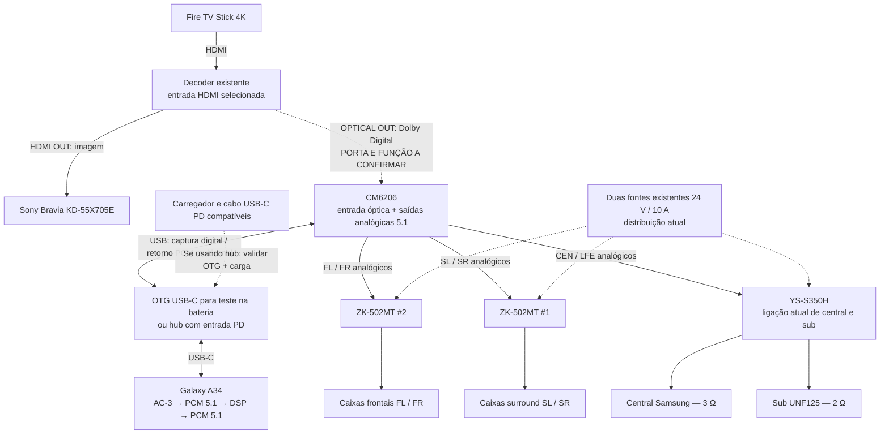
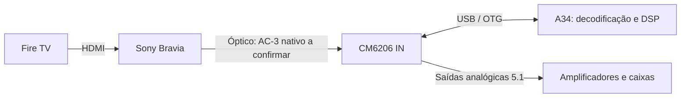

# Plano aprovado: Galaxy A34 como processador do sistema 5.1

Registro da decisão de projeto em **05/10/2026**. O usuário escolheu reaproveitar o Galaxy A34, manter o Fire TV como player e usar processamento de áudio por software. Este documento descreve a implementação a desenvolver: **não há APK, captura óptica ou cadeia Android completa validada nesta publicação**.

Documentos complementares: [pesquisa e orçamento](A34-ORCAMENTO-E-PESQUISA.md), [programação e validação](A34-DESENVOLVIMENTO-E-VALIDACAO.md), [arquitetura Windows existente](ARQUITETURA.md).

## Objetivo e equipamento existente

Manter a praticidade do Fire TV em Netflix, Prime Video e YouTube, com a imagem chegando à Sony em 4K60 quando fonte, conteúdo e todos os equipamentos do caminho permitirem. Processar somente o áudio no A34: equalização, volumes, cortes, distribuição de graves, upmix de fontes mono/estéreo e atrasos por canal.

| Equipamento | Situação registrada |
| --- | --- |
| Samsung Galaxy A34 | Já disponível; começar no Android original, sem root |
| Fire TV Stick 4K | Já disponível; alimentação micro-USB, geração exata ainda desconhecida |
| Sony Bravia KD-55X705E | Modelo informado pelo usuário; a especificação Sony lista 4K60 e HDCP 2.2 |
| Decoder UD851B | Já disponível; Dolby Digital 5.1 confirmado pelo usuário no uso com o PC |
| Cabos HDMI | Já disponíveis |
| Cabo óptico curto | Já disponível, veio com o decoder |
| ZK-502MT #2 | Amplifica FL/FR |
| ZK-502MT #1 | Amplifica SL/SR |
| YS-S350H | Central Samsung de 3 Ω em um canal L/R e sub UNF125 de 12 polegadas / 2 Ω no canal SW |
| Alimentação dos amplificadores | Duas fontes de 24 V / 10 A, preservando a distribuição atual |

O YS-S350H também envia os graves de sua entrada da central ao sub. Essa mistura física continua existindo mesmo com o DSP; não presumir que CEN e LFE ficam totalmente independentes depois desse módulo. O gabinete selado do sub foi descrito como mal dimensionado, com pico perceptível entre 50 e 60 Hz. A EQ deve ser revista por medição, sem tratar o preset antigo como resposta universal.

## Opção econômica escolhida para investigar

Reutilizar o decoder como extrator de áudio HDMI e fazer a conversão analógica final na CM6206. Assim, o áudio processado **não volta ao mesmo decoder**.

**Condição ainda aberta:** a unidade existente precisa ter uma saída óptica que entregue o Dolby Digital recebido por HDMI. A ficha consultada do UD851B lista somente entrada óptica e saídas RCA/HDMI. O manual do **UD951B**, modelo diferente, documenta óptica IN e OUT. Não assumir essa porta no UD851B por semelhança de nomes ou anúncios. Confirmar a traseira e as inscrições da unidade antes de comprar acessórios para esta rota.

Usar o único cabo óptico existente entre OPTICAL OUT do decoder e OPTICAL IN da CM6206, se essa saída realmente existir. As saídas RCA do decoder deixam de alimentar os amplificadores nessa opção. Dependendo do painel da CM6206, adaptar as ligações para três saídas P2 estéreo: frontais, surrounds e central/sub. Não conectar duas saídas de aparelhos à mesma entrada de amplificador.

A mesma conexão USB da interface leva o fluxo recebido ao telefone e traz os seis canais processados de volta. O A34 não recebe cabo óptico ou HDMI diretamente. Nesta opção, **não é necessário recodificar o áudio em AC-3 na saída**: o retorno é PCM multicanal por USB, convertido para analógico pela CM6206.

### Por que não usar o mesmo decoder como ida e volta óptica

Uma caixa com OPTICAL IN e OUT não necessariamente oferece roteamento independente de efeitos. O manual do UD951B descreve fonte selecionada alimentando as saídas. Ao selecionar o retorno óptico processado, não está documentado que o áudio HDMI original continue saindo pela óptica. Portanto, não projetar HDMI → decoder → A34 → mesmo decoder como se houvesse um envio/retorno independente. A opção econômica evita essa dependência ao usar a CM6206 para a saída analógica.

## Alternativas se o decoder não tiver OPTICAL OUT

### Usar a saída óptica da própria Sony

Esta opção também dispensa extrator externo. Antes de comprar a interface, testar Fire TV → TV → óptico → UD851B usando o cabo existente. Confirmar seis canais discretos de uma fonte conhecida: a indicação de modo 5.1 ou seis caixas tocando por upmix não comprova transporte 5.1 nativo. Ainda não foi confirmado que essa Sony repassa AC-3 de uma entrada HDMI para a saída óptica em todos os aplicativos.

### Extrator HDMI externo e saídas analógicas da CM6206

Fire TV → extrator 4K60/HDCP 2.2 → HDMI para a TV; óptico do extrator → CM6206 → A34 → CM6206 analógica → amplificadores. Continua usando um único cabo óptico e sem retorno ao decoder, mas acrescenta o extrator ao orçamento.

### Montagem anteriormente estudada com retorno ao UD851B

Fire TV → extrator → TV; extrator OPTICAL OUT → CM6206 IN → A34 → CM6206 OUT → UD851B OPTICAL IN → RCA → amplificadores. Exige dois cabos ópticos, recodificação AC-3 no A34 e comprovação da transmissão digital de saída da interface. É alternativa, não a opção econômica atual.

## Processamento a reaproveitar

O programa Windows existente usa aplicativos → VB-CABLE / Equalizer APO → WASAPI loopback C# → WAV float32, seis canais e 48 kHz → mpv com DSP → AC-3 → HDMI → UD851B. O relay existente não captura automaticamente uma entrada óptica externa.

Reaproveitar os parâmetros e os algoritmos; adaptar a captura e o motor para Android. Preservar entrada 5.1 conhecida, sem classificá-la como estéreo somente porque uma cena tem atividade apenas em L/R. Oferecer modo explícito nativo e modo de upmix para fontes realmente mono/estéreo.

| Função | Referência existente / migração |
| --- | --- |
| Atrasos FL/FR | 3686 amostras a 48 kHz ≈ 76,79 ms; pedido inicial arredondado em 76 ms |
| Atraso CEN | 278 amostras ≈ 5,79 ms; pedido inicial arredondado em 5 ms |
| Atraso SL/SR | 3408 amostras = 71 ms |
| Atraso LFE | Zero adicional programado |
| Surrounds | Corte de graves em 90 Hz e envio da faixa grave ao LFE |
| Subwoofer | EQ paramétrico, volumes e margem contra saturação |
| Graves da central | Resolver a divergência: grafo existente copia abaixo de 120 Hz ao LFE, mas preset exportado tinha CenterBassEnabled=false |
| Upmix | Adaptar regras do StereoUpmix.cs; não confundir com recuperação de canais nativos |
| Relógios | Não copiar asetrate=48002 como calibração universal; acompanhar fila e compensar deriva após decodificar |

Esses atrasos são referências iniciais do sistema anterior. A troca do conversor e da rota de áudio exige nova medição; não aplicar 71 ms adicionais por hábito sem comprovar a diferença dos amplificadores.

## Latência estimada e sincronização

Hipótese solicitada pelo usuário: contribuição do UD851B próxima de zero. Na opção econômica, ele somente recebe HDMI e fornece a saída digital; a decodificação de AC-3 para o DSP acontece no A34.

**Estimativa de planejamento, sem benchmark do A34/CM6206:** reservar 60–120 ms para a cadeia de captura, processamento e reprodução, antes dos atrasos deliberados de cada canal. Usar 80 ms como exemplo de orçamento. Aplicação e buffers ainda inexistem, então essa faixa não é garantia, limite mínimo ou máximo.

| Parcela do exemplo | Reserva ilustrativa |
| --- | ---: |
| Receber/reunir AC-3 para decodificar | 32 ms |
| Fila e transporte de entrada USB | 20 ms |
| Decodificação e DSP simples | 3 ms |
| Fila/saída USB e conversão analógica | 25 ms |
| Total do exemplo | 80 ms |

AC-3 tem quadros de 1536 amostras, correspondentes a 32 ms a 48 kHz. A duração do quadro **não é automaticamente um atraso adicional fixo de 32 ms**: transporte, recepção e filas podem se sobrepor. Os valores da tabela são uma alocação ilustrativa, não medições separadas ou uma exigência do protocolo. Filtros com convolução/lookahead e filas maiores mudam o orçamento.

Somando os atrasos deliberados e supondo, somente para o exemplo, diferença de 71 ms no YS em relação aos ZK: frontais/central chegam perto de 156–157 ms e surrounds/sub perto de 151 ms, antes da propagação acústica. A faixa de planejamento com essa compensação é aproximadamente 130–200 ms. Medir a diferença real do YS; ela não foi aferida nesta pesquisa.

**Tempo até as caixas não é o erro de sincronismo labial.** O atraso de exibição da Sony, a temporização do player e a correção AV do Fire TV também entram na diferença entre imagem e som. A boa sincronia relatada no PC não comprova a cadeia externa.

O Fire TV oferece Configurações → Tela e sons → Áudio → Ajuste de sincronização AV, quando disponível. A orientação Amazon é mover para a esquerda quando o tom ocorre depois da imagem, e para a direita quando ocorre antes. Testar ouvindo o sistema completo e depois validar Netflix, Prime e YouTube no formato Dolby Digital usado. Não foi confirmado o alcance do ajuste, nem sua aplicação efetiva a todos esses caminhos no modelo exato do usuário. Ele pode compensar a diferença percebida; não acelera o DSP do A34. Esta rota não fornece ao aplicativo Android um buffer de vídeo ajustável.

## Situação da decisão

- A34 escolhido como primeiro protótipo; Fire TV mantido.
- Começar com Android original e desenvolvimento pelo PC, depois execução independente.
- Reutilização do decoder para economizar escolhida como opção **condicional à sua saída óptica**.
- CM6206 escolhida como interface candidata, **condicional à captura AC-3 íntegra e reprodução multicanal simultânea**.
- Nenhuma compra, root, troca de sistema, firmware ou instalação no telefone foi realizada nesta etapa.
- Primeiro trabalho de software: reproduzir os filtros com arquivos conhecidos e criar diagnóstico de canais; primeiro trabalho físico: confirmar as portas da unidade existente.

## Referências

- [Especificações Sony KD-55X705E](https://www.sony.com.br/electronics/support/televisions-projectors-lcd-tvs/kd-55x705e/specifications)
- [UD851B: ficha da versão vendida pela Microware, óptica de entrada](https://microware.in/product/microware-5-1-surround-sound-decoder-compatible-with-dts-ac3-hdmi-2-0b-4k-60hz-hdr-3d-hdcp-2-3-2-2-1-4-separator-extractor-192khz-24bit-digital-analog-audio-video-system-for-movies-games-music/)
- [UD951B: manual do fabricante com óptica IN/OUT, modelo diferente](https://fccid.io/2A6G5-UD951B/User-Manual/User-manual-6197029.pdf)
- [ATSC A/52: AC-3 e duração dos quadros](https://www.atsc.org/wp-content/uploads/2015/03/A52-2018.pdf)
- [Android: projeto para reduzir latência](https://source.android.com/docs/core/audio/latency/design)
- [Android: medir latência de entrada e saída](https://source.android.com/docs/core/audio/latency/measure)
- [Amazon: ajuste AV do Fire TV](https://digprjsurvey.amazon.com/csad/help/node/GRZKUFGWX49Z6SWC)
