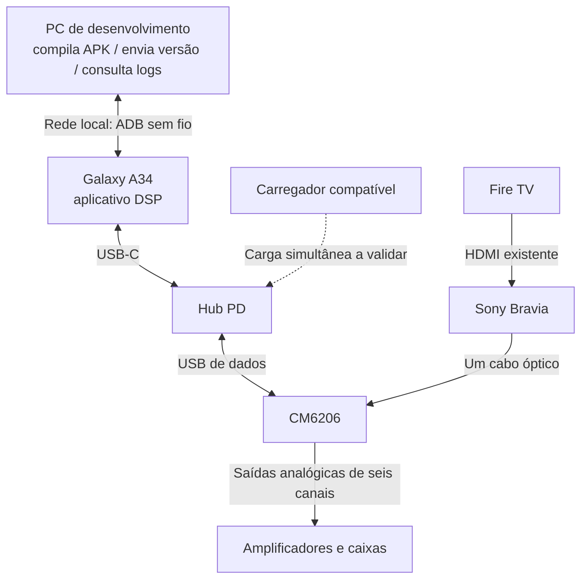

# Estudo de viabilidade: manutenção do A34 sem desmontar o sistema

Registro em **06/10/2026**. Objetivo: atualizar o aplicativo, diagnosticar o áudio e alterar parâmetros mantendo o Galaxy A34 instalado junto à CM6206 e ao hub PD.

**Estado:** possibilidade documentada, com suporte geral do Android para instalação e depuração sem fio. Não foi realizado pareamento, instalação de APK ou teste no A34 do projeto. O aplicativo DSP e o painel remoto ainda não existem. A viabilidade do transporte de áudio da CM6206 no Android continua uma condição separada.

Ver [programação e validação](A34-DESENVOLVIMENTO-E-VALIDACAO.md), [arquitetura](A34-DSP.md) e [notas sobre ligações e controle](A34-NOTAS-COMPLEMENTARES.md).

## Contexto informado pelo usuário

Em 06/10/2026, o usuário informou a compra da CM6206 e de um hub PD. A chegada da placa, o modelo do hub, o carregamento simultâneo com USB host e o funcionamento da cadeia de áudio ainda precisam ser verificados.

A montagem investigada é Fire TV → HDMI → Sony → óptico → CM6206 ↔ USB/hub ↔ A34 → saídas analógicas CM6206 → amplificadores. Sem retorno ao UD851B, utiliza somente um cabo óptico; se o cabo atual for devolvido com o decoder, será necessário obter um substituto, não dois.

## Atualização e diagnóstico pelo Wi-Fi

Android 11 ou superior permite instalar e depurar aplicativos por ADB sem fio. A proposta é habilitar Depuração sem fio nas opções do desenvolvedor do A34 e parear o PC por código ou QR. O pareamento inicial também pode ser feito sem cabo USB.

A rede deve permitir comunicação entre PC e A34. Pareamento é uma autorização de desenvolvimento no aparelho; não é root. Wi-Fi transporta manutenção e comandos, não o fluxo de áudio do Fire TV.

Durante USB host, a porta do telefone fica ocupada pela interface/hub. ADB sem fio evita retirar essa conexão. O PC não deve ser conectado ao hub como um segundo host da mesma CM6206.

O pareamento pode permanecer salvo, mas a conexão pode precisar ser reativada após reinício, mudança de rede ou desativação da depuração. Verificar esse comportamento na versão Android/One UI real. Poder tocar na tela do celular instalado continua sendo uma necessidade possível; não prometer manutenção sem nenhuma interação local em qualquer situação.

## O que exige novo APK e o que pode ser configuração

| Mudança | Caminho proposto | Estado |
| --- | --- | --- |
| Código de captura USB, codec, algoritmo DSP ou interface | Compilar APK e instalar atualização por ADB sem fio | Suporte geral documentado; projeto ainda não implementado |
| EQ, volumes, cortes, atrasos e escolha de perfil | Parâmetros persistidos no aplicativo | A implementar |
| Ajustar esses parâmetros de outro aparelho | Painel web autenticado na rede local, hospedado no A34 | Possibilidade a estudar e implementar |
| Consultar logs e executar diagnóstico de desenvolvimento | ADB sem fio | Pareamento e uso real pendentes |
| Operar áudio no dia a dia | Aplicativo executando no A34, independente do PC | Cadeia de áudio pendente |

Uma atualização de APK pode encerrar o processo/serviço de áudio. Planejar interrupção de manutenção, parada controlada, instalação e retomada; não prometer áudio ininterrupto durante troca de código.

Usar identificador de pacote estável, mesma chave de assinatura e versões adequadas para atualizar sobre a instalação existente. Persistir perfis e implementar migração de configurações quando o formato mudar. Não desinstalar como rotina de atualização: a preservação efetiva dos perfis deve ser testada.

O painel web é uma proposta, não uma função já entregue pelo controle Windows. Hospedá-lo no A34 e adaptar autenticação, validação e aplicação dos parâmetros. Não publicar PIN, chave de assinatura, endereços privados ou códigos de pareamento no repositório.

## Critérios para considerar viável

1. Registrar Android/One UI do A34 e confirmar que Depuração sem fio está disponível e pode parear com o PC na rede usada.
2. Instalar um APK mínimo pela rede com CM6206 e hub conectados, sem retirar o cabo USB-C.
3. Consultar logs e reiniciar o aplicativo pela rede, verificando reconexão e acesso USB.
4. Atualizar uma segunda versão com a mesma assinatura, confirmar preservação dos perfis e registrar se o Android pede novamente permissão USB.
5. Com o motor de áudio funcional, parar de forma controlada, atualizar e retomar captura/reprodução; medir interrupção e verificar canais, ganho e ausência de estalos.
6. Verificar reconexão ADB após reinício, tela apagada e mudança de conexão Wi-Fi; documentar eventual intervenção na tela.
7. Verificar carga e funcionamento da CM6206 pelo hub durante a manutenção; compra de um hub PD não comprova compatibilidade.
8. Se o painel web for implementado, testar autenticação e edição de parâmetros sem reinstalar o APK, com validação de faixas e persistência.

O sucesso de ADB sem fio comprova manutenção pela rede, não captura AC-3/DTS intacta nem seis saídas simultâneas. Testar essas capacidades conforme o roteiro de áudio.

## Processamento equivalente ao PC

O Android pode executar decodificação e DSP em software e enviar áudio a uma interface USB. A proposta conserva a sequência do programa Windows: entrada → decodificação para PCM multicanal → filtros/mixagem/atrasos/volume → reprodução USB.

Reaproveitar algoritmos e calibração exige portar o motor; scripts PowerShell, drivers Windows e integração WASAPI não rodam diretamente no telefone. O caminho automático USB do Android não garante as funções avançadas pretendidas. Acesso USB específico no aplicativo pode ser necessário, e sua implementação depende dos descritores e do comportamento real da CM6206. Não tratar processamento equivalente como prova de compatibilidade de toda a cadeia.

## Fontes primárias

- [Android: instalação, pareamento e depuração pelo Wi-Fi](https://developer.android.com/studio/run/device#wireless)
- [Android: ADB sem fio, reconexão e comandos de instalação](https://developer.android.com/tools/adb)
- [Android: assinatura e atualizações de aplicativos](https://developer.android.com/studio/publish/app-signing)
- [Android: áudio USB, limites do caminho padrão e depuração em modo host](https://source.android.com/docs/core/audio/usb)
- [Android: descoberta e autorização de acesso USB](https://developer.android.com/develop/connectivity/usb/host)

As referências sustentam recursos da plataforma. A aprovação final requer evidências no A34, no hub e na CM6206 adquiridos.
