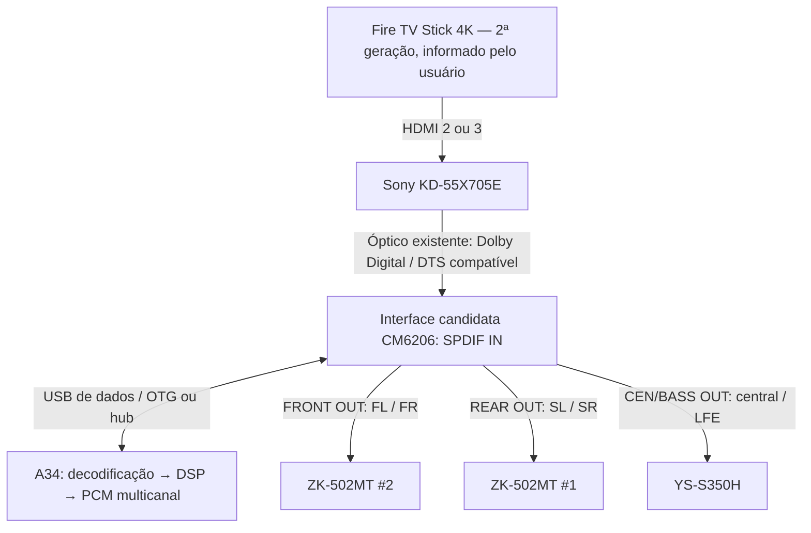

# A34: notas complementares sobre codecs, controle e ligações

Registro de conhecimento em **05/10/2026**, após a publicação inicial do plano. Estas notas consolidam a discussão; **não são implementação, teste físico concluído nem decisão de compra**.

Ver também [plano e diagramas](A34-DSP.md), [desenvolvimento e validação](A34-DESENVOLVIMENTO-E-VALIDACAO.md) e [orçamento de referência](A34-ORCAMENTO-E-PESQUISA.md).

## Direção mais recente: conversão analógica na interface

O usuário observou que o UD851B seria redundante depois do A34 e da CM6206. Na rota abaixo, o telefone decodifica e processa; a interface converte o PCM multicanal para seis saídas analógicas. O decoder não participa dessa rota. A preferência técnica discutida foi essa montagem, ainda dependente de validação e sem compra autorizada.



A ligação USB é bidirecional **somente se o dispositivo e o software comprovarem captura e reprodução simultâneas**. OPTICAL IN não comprova captura AC-3/DTS intacta; seis conectores/canais anunciados não comprovam o mapa USB no Android. Nenhuma dessas capacidades foi medida nesta conversa.

O UD851B pode continuar disponível para a ligação direta TV → óptico → decoder → amplificadores quando não se usa o A34. Trocar fisicamente a fonte ou empregar um seletor adequado; não unir as saídas analógicas de dois aparelhos com um cabo em Y.

## Reaproveitamento dos cabos dos amplificadores

A foto da interface mostra FRONT OUT, REAR OUT e CEN/BASS OUT em P2, além de LINE IN, MIC IN e óptica IN/OUT. Cada saída P2 estéreo transporta dois canais analógicos separados.

| Saída | Amplificador | Canais |
| --- | --- | --- |
| FRONT OUT | ZK-502MT #2 | FL / FR |
| REAR OUT | ZK-502MT #1 | SL / SR |
| CEN/BASS OUT | YS-S350H | Central / LFE; conferir a ordem e a mistura interna do módulo |

Três cabos P2 estéreo macho → P2 estéreo macho serviriam se as entradas dos módulos forem P2. O usuário prefere não comprar novos cabos.

**Alternativa física a cotar:** se os cabos existentes forem dois RCA machos → P2 macho, usar três adaptadores **P2 estéreo macho → dois RCA fêmeas**, um por saída da interface:

```text
Saída P2 da CM6206 → adaptador P2 / 2 RCA fêmeas
                  → cabo RCA / P2 existente → amplificador
```

Confirmar os conectores e a pinagem central/sub antes de escolher os adaptadores. Não foi comparado o preço desses adaptadores com cabos novos e não há valor adicional cotado.

O conector USB da outra foto pequena aparenta Mini-USB Mini-B, mas a identificação não está confirmada. Usar cabo USB de dados do padrão correto, preferencialmente o fornecido com a interface, e OTG USB-C no A34. O telefone não se conecta à interface por P2.

## Preservar o UD851B como saída final

Para aproveitar o decoder e seus cabos atuais sem adaptar as três saídas P2, a alternativa é:

```text
Fire TV → HDMI → Bravia
Bravia OPT OUT → óptico nº 1 → interface SPDIF IN
Interface ↔ USB / OTG ↔ A34: decodificação → DSP → codificação AC-3
Interface SPDIF OUT → óptico nº 2 → UD851B OPT IN
UD851B → cabos RCA/P2 existentes → amplificadores
```

Essa montagem requer **dois cabos ópticos no total**, portanto mais um se houver apenas o cabo curto atual. Requer também AC-3 codificado no A34 e transmissão não-PCM intacta pela saída óptica da interface enquanto ocorre captura. Óptico/S/PDIF não transporta seis canais PCM independentes; Dolby Digital 5.1 é uma alternativa comprimida compatível.

A entrada pode ser DTS e a saída AC-3: decodificar DTS para PCM, aplicar DSP e codificar AC-3. **Não é obrigatório implementar um codificador DTS** para preservar os seis canais nessa rota.

## Entrada PC-USB do UD851B: possível economia, ainda não comprovada

A entrada PC-USB pode ser investigada como saída do A34 para o decoder. A existência dessa entrada não demonstra que áudio recebido por HDMI ou óptica seja enviado ao telefone por USB.

| Capacidade | Estado |
| --- | --- |
| Seis canais disponíveis pela conexão HDMI do PC | Informado pelo usuário |
| Seis canais PCM independentes pela PC-USB | Desconhecido |
| Dolby Digital por PC-USB | Desconhecido |
| Reprodução PC-USB no Android | Desconhecido |
| Captura da entrada óptica/HDMI pela USB | Não comprovada |
| Captura e retorno processado simultâneos no mesmo decoder | Não comprovados |

Um adaptador OTG apenas conecta; não acrescenta captura, codecs ou roteamento que o firmware não oferece. Não transferir para a PC-USB as capacidades vistas pelo HDMI.

Primeiro teste proposto: conectar o UD851B ao PC pela PC-USB, selecionar essa fonte e verificar dispositivos de reprodução/gravação, formatos e canais. Se houver captura, testar se ela realmente entrega a fonte óptica/HDMI, preserva canais/fluxo e funciona junto com o retorno processado. A simples presença de um dispositivo de gravação não comprova esse percurso.

Se a PC-USB aceitar PCM de seis canais, o retorno A34 → hub USB → UD851B poderá dispensar a segunda fibra e a recodificação de saída, mantendo uma interface separada para captura. Somente se o decoder oferecer também a captura e o retorno simultâneo necessários será possível investigar a eliminação completa da CM6206. Nenhuma das duas hipóteses está validada.

## Sony: suporte documentado e limites do bitrate

O manual exato da KD-55X705E acrescentou evidências à pesquisa inicial:

- **Página 46:** saída óptica com PCM linear de dois canais a 48 kHz/16 bits, Dolby Digital e DTS. ARC, no HDMI 3, também lista Dolby Digital Plus.
- **Página 25:** em “Dolby Digital Plus Out”, a opção “Não” converte DD+ em DD para ARC e óptica. Em Auto, a saída óptica fica muda enquanto DD+ é enviado pelo ARC. Não presumir que qualquer extrator externo também faça essa conversão.
- **Página 31:** saída digital Auto 1 envia áudio comprimido sem alteração; Auto 2 aplica isso ao multicanal. O formato HDMI Aprimorado está disponível nas entradas 2 e 3.
- **Página 45:** suporte a HDCP 2.2 e entrada 4K a 50/60 Hz; usar HDMI 2/3 no formato apropriado para os modos de maior qualidade.

O manual sustenta a investigação de TV → óptico → interface sem extrator externo. O repasse real por aplicativo, codec e configurações ainda precisa de teste. O Fire TV pode usar HDMI 2; ARC não é necessário quando o áudio sai pela óptica.

Não foi encontrado um teto único de bitrate óptico publicado pela Sony. PCM 2 × 48 kHz × 16 bits corresponde a **1536 kbit/s de dados úteis**, sem representar o bitrate total do enlace nem seis canais PCM. O formato Dolby Digital permite até **640 kbit/s**; DTS Digital Surround tem modalidades próximas de **1500 kbit/s**. Esses limites de formato não comprovam o bitrate produzido na conversão DD+ → DD da TV nem o repasse efetivo de DTS nesse bitrate por esta unidade. DTS-HD não equivale ao núcleo DTS convencional usado nesse percurso.

A 2ª geração do Fire TV Stick 4K foi confirmada pelo usuário. A documentação Amazon do modelo de 2023 lista DTS passthrough; isso depende do player e do conteúdo. Não significa que Netflix/Prime transmitam DTS, nem dispensa suporte ao codec recebido no aplicativo do A34. Priorizar AC-3 e acrescentar decodificação DTS se essa entrada fizer parte do uso/teste.

## Volume com o controle do Fire TV

Na rota com saídas analógicas da CM6206, o volume mestre deve atuar **depois da decodificação**, nos seis canais PCM, preservando os ajustes relativos de cada caixa. Não aplicar ganho ao AC-3/DTS encapsulado antes de decodificar.

A saída óptica Sony tem nível fixo. Ajustar o volume da TV não controla automaticamente o som nessa rota. HDMI-CEC não se propaga pelo cabo óptico.

Proposta de controle, ainda sem firmware ou APK:

```text
Controle Fire TV: volume + / − / mute por infravermelho
        → ESP32 + receptor IR
        → comandos autenticados na rede Wi-Fi local
        → aplicativo do A34: volume mestre / mute
        → seis canais de saída
```

Configurar no Fire TV um perfil de equipamento de áudio compatível que emita códigos IR identificáveis; capturar códigos e repetições no ESP32. O controle mantém a navegação no Fire TV. Wi-Fi transporta comandos, não o áudio. Escolher perfil que evite comandos indesejados na TV e validar botões, repetição, mute e reconexão. Não pressupor que o controle aprenda códigos arbitrários.

A Amazon informa que botões de volume de seus controles não podem ser mapeados a eventos por aplicativos de terceiros no Fire TV. Portanto, não tratar um simples remapeamento por aplicativo como solução pronta.

Se o UD851B permanecer como decoder final, primeiro tentar um perfil de receiver no Controle de equipamentos do Fire TV que acione diretamente volume/mute do UD851B. **Não há perfil compatível confirmado.** Se ele estiver apenas antes do DSP, controlar seu volume analógico não controla as saídas da CM6206.

## Pendências antes de comprar ou implementar a cadeia completa

1. Testar a PC-USB do UD851B no PC existente.
2. Testar a saída óptica Sony com o decoder e o cabo já disponíveis, usando canais discretos conhecidos.
3. Confirmar o hardware/firmware da interface, captura comprimida íntegra e reprodução multicanal simultânea no A34.
4. Conferir cabos atuais e cotar adaptadores, sem assumir que sejam mais baratos.
5. Validar carga/OTG, mapeamento, estabilidade e latência; implementar controle de volume remoto somente após o percurso básico funcionar.

## Fontes técnicas

- [Sony: manual original KD-55X705E / KD-49X705E, páginas 25, 31, 45 e 46](https://www.sony.com/electronics/support/res/manuals/W000/W0006624M.pdf)
- [Sony: saída óptica com nível fixo](https://www.sony.com/electronics/support/articles/00022071)
- [Amazon: especificações das gerações Fire TV, incluindo Stick 4K de 2023](https://developer.amazon.com/docs/device-specs/device-specifications-fire-tv-streaming-media-player.html)
- [Dolby: comparação de Dolby Digital e Dolby Digital Plus](https://professional.dolby.com/technologies/dolby-digital-plus/)
- [DTS: Digital Surround até 1,5 Mbit/s](https://consumer.dts.com/professional-auto-solutions/)
- [Android: modo USB host](https://developer.android.com/develop/connectivity/usb/host)
- [Amazon: eventos de controle remoto e limitações de botões de volume](https://developer.amazon.com/docs/fire-tv/remote-input.html)
- [Amazon: controle de equipamentos compatíveis](https://digprjsurvey.amazon.co.uk/csad/help/node/G4FBZV66HR97TD7Z)
- [Amazon: controle com Bluetooth e infravermelho](https://press.aboutamazon.com/2018/10/introducing-amazon-fire-tv-stick-4k-and-the-all-new-alexa-voice-remote-with-device-control)
- [IRremoteESP8266: recepção/transmissão IR em ESP8266 e ESP32](https://github.com/crankyoldgit/IRremoteESP8266)
