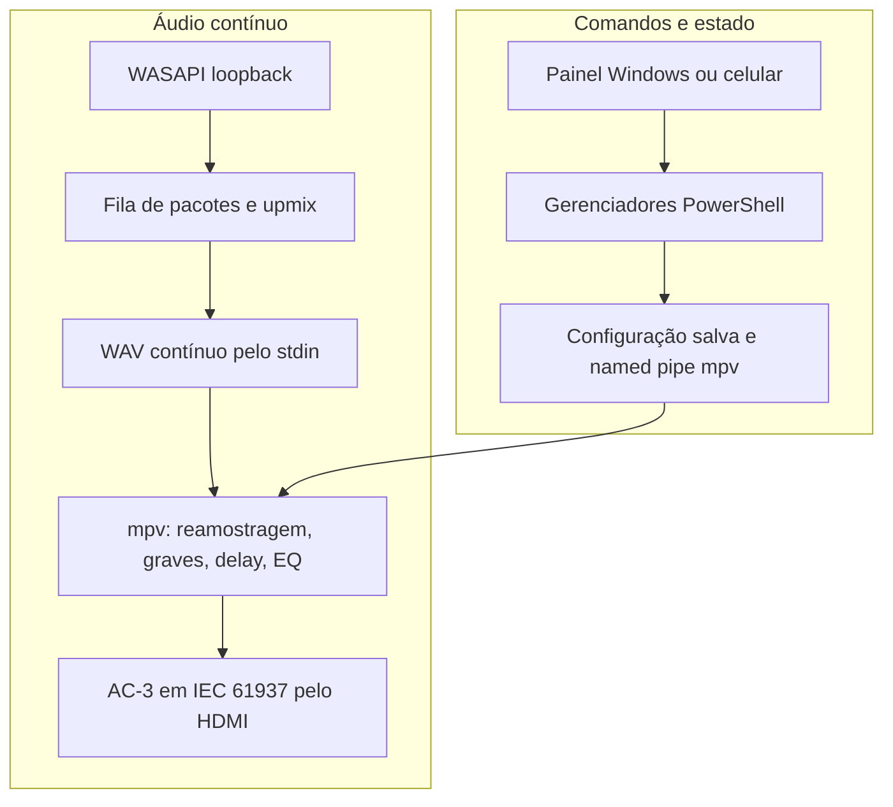

# Arquitetura e decisões

## 1. Dois planos independentes

O caminho contínuo de áudio roda no relay C# e no mpv. Os painéis e o servidor web enviam comandos para essa rota, mas não transportam amostras pelo HTTP. Uma falha do controle remoto não deveria encerrar o codificador de áudio.

## 2. Entrada e upmix

A saída padrão é o endpoint de reprodução **CABLE Input**, configurado em seis canais. O relay usa loopback desse endpoint de reprodução. Isso é diferente de abrir diretamente o dispositivo de gravação CABLE Output.

O Equalizer APO em `Stage: pre-mix` identifica o número de canais de cada aplicativo antes de sua mistura. O arquivo `upmix-sistema-5.1.txt` preenche central, LFE e surrounds para mono/estéreo; uma entrada declarada 5.1 passa sem essa expansão.

`StereoUpmix.cs` oferece um segundo mecanismo baseado na atividade dos canais: no modo automático, pode expandir trechos que apresentam somente os frontais. A lógica usa uma espera de 1,5 segundo e transição de 100 ms, em vez de alternar instantaneamente. Essa espera de detecção **não é um buffer que segura todo o áudio por 1,5 segundo**.

O modo **Preservar 5.1** evita essa expansão por atividade de um fluxo multicanal. Fontes mono/estéreo ainda podem receber o upmix por aplicativo no APO. Leia os modos reais do relay antes de transplantar apenas `StereoUpmix.cs`; não aplique duas expansões independentes sem conferir os canais de entrada.

Ordem PCM usada internamente: `FL, FR, CEN, LFE, SL/SR`. Índices `0,1,2,3,4,5`; os layouts de FFmpeg podem chamar os dois últimos de back ou side. Os filtros usam índices para manter a ordem.

## 3. Relay de baixa latência

Fonte atual: `RelayLoopbackLowLatency.cs`. As classes de `RelayLoopback.cs` também são compiladas para tipos/interfaces compartilhados; a variante antiga não é o ponto de execução principal.

- Formato esperado: seis canais, 48.000 Hz, float32; 24 bytes por frame.
- Pacote máximo: 480 frames, aproximadamente 10 ms.
- Pool inicial: 16 pacotes reutilizáveis, evitando novas alocações a cada captura.
- Fila: ao ultrapassar 80 ms de dados, descarta pacotes antigos até cerca de 60 ms. Esses números são limites de recuperação, não uma espera obrigatória de 80 ms.
- Captura e escrita têm threads próprias e usam MMCSS quando disponível.
- O log contabiliza captura, envio, silêncio de preenchimento, descartes, duração das escritas, fila e alocações.
- O WAV contínuo declara tamanho aberto e o mpv usa `ignore_length=1`; isso permite pacotes pequenos no stdin sem esperar um arquivo WAV inteiro.

Há uma compensação de relógio no filtro mpv: declarar 48.002 Hz e reamostrar para 48.000 Hz. O ajuste de cerca de 41,7 ppm foi escolhido para este par VB-CABLE/HDMI. A taxa dos dispositivos, a deriva observada e a correção relativa entre caixas são problemas diferentes.

## 4. DSP e codificador

O `af=` encadeia um grafo `lavfi` e `lavcac3enc`. A ordem pretendida é:

1. Compensar relógio e reamostrar para 48 kHz.
2. Se solicitado, dividir as surrounds com crossover e enviar sua parte grave ao LFE.
3. Se solicitado, copiar os graves da central para o LFE, mantendo a central completa.
4. Aplicar `adelay` individual em amostras.
5. Aplicar margem da soma, ganho LFE e equalizadores paramétricos somente no LFE.
6. Aplicar volume mestre comum.
7. Codificar AC-3 e empacotar para a saída digital.

As cópias de graves são feitas antes dos atrasos, para que o material destinado ao subwoofer siga o tempo do LFE, sem herdar o delay da caixa que o originou. Os filtros passam-baixas e o crossover também alteram fase: `adelay=0` não significa ausência de todo atraso físico ou de fase.

O EQ usa filtros IIR causais, sem lookahead e com `block_size=0`; ele não acrescenta uma fila deliberada. A formação de frames AC-3, a saída WASAPI, o decoder e o próprio filme continuam contribuindo para a latência total. O valor `audio-buffer=0.032` não representa a latência ponta a ponta.

`LFE equalizador comum.ps1` remove e recria apenas os filtros identificados por este painel, preservando os delays e a cadeia do codificador. O ganho mestre é comum às seis caixas. Uma curva com bandas positivas sobrepostas pode elevar bastante o pico do LFE; a opção AutoHeadroom calcula uma margem conservadora.

## 5. Gerenciamento transacional

`Audio gerenciamento comum.ps1` concentra identidade de processos, gravação de arquivos e locks. A ordem de locks das alterações é **ciclo de vida → configuração**. O runner usa somente o lock de configuração quando atualiza o HDMI.

`Ajustar atrasos.ps1` verifica que os dois perfis contêm exatamente um delay equivalente. Converte milissegundos em amostras a 48 kHz, pode aplicar o grafo ao vivo pela named pipe e tenta restaurar o grafo anterior se a gravação falhar. Isso evita deixar o som e o arquivo salvo com calibrações diferentes.

O controle de volume prefere atualizar o filtro existente em vez de reiniciar o processo inteiro. As mudanças de perfil ou rota podem exigir interrupção/reinício; a interface informa essa diferença.

`rodar-audio-sistema.ps1` mantém um único runner por mutex, procura o HDMI esperado, lança o relay e recupera a conexão após falha. Flags de parada/desligamento têm papéis diferentes: uma encerra a sessão atual, outra preserva a preferência de permanecer desligado.

## 6. Controle remoto

`server.mjs` usa apenas módulos nativos do Node. Serve o site e encaminha comandos para um único `worker.ps1`, por stdin/stdout em JSON. `worker-bridge.mjs` serializa a fila, impõe limite e timeout e descarta um worker que ficou bloqueado. Não reenvia automaticamente um comando após timeout: um clique ou toggle repetido pode causar uma segunda ação.

O status tem cache curto para reduzir o custo do WinRT e do diagnóstico PowerShell. O cliente também serializa volume, limita repetição de setas e impede uma resposta de status antiga de restaurar um volume anterior.

O servidor exige sessão obtida com PIN e valida Host/Origin nos comandos HTTP. A ponte Netflix usa outra chave gerada localmente e recebe conexões somente por loopback. A senha Jellyfin não vai para arquivo; o token fica na sessão do servidor.

`UniversalRemote.cs` enumera janelas, usa HWND/PID/início do processo na identidade, verifica o foco antes do SendInput e rejeita janelas encerradas. O worker cria sua fila de mensagens antes de anexar filas de input para ativar uma janela. Aplicativos elevados e telas bloqueadas não são tratados como destinos comuns.

Netflix tem um vínculo lógico no cliente, `app:netflix`. Cada consulta o resolve para a janela atual, preferindo o app instalado. Isso evita guardar para sempre o HWND de uma abertura anterior. O botão **Controlar Netflix** limpa a seleção de mídia antiga e escolhe o modo Mouse. Para outra UI sem navegação por setas, o mouse é o caminho comum.

## 7. Integrações com serviços

Jellyfin: o servidor local fornece sessões controláveis, comandos de reprodução/navegação e seleção de streams. O endereço está fixado em `http://127.0.0.1:8096` no servidor do controle.

Netflix: o iniciador pede opções 5.1 por parâmetros do player. A ponte opcional de áudio/legendas usa APIs internas do player e precisa ser tratada como integração sujeita a mudanças. O método anterior `cadmiumconfig.py` ficou para diagnóstico e reversão; ele não foi suficiente sozinho para oferecer 5.1.

YouTube: há bookmarklet e extensão experimentais. A tentativa manual continuou recebendo AAC/Opus estéreo. Não transformar a presença desses fontes ou testes unitários em promessa de entrega 5.1 no Opera.
