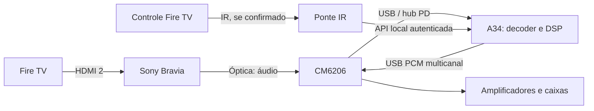

# Fire TV controlando o volume do sistema 5.1 no A34

Atualizado em **09/10/2026, horário de Brasília**. **Estado: plano de implementação; integração Fire TV ainda não executada nem validada.** O Fire TV e seu controle precisam estar disponíveis para identificar modelo, protocolo e comportamento. Este documento complementa o [relatório da rota de áudio](RELATORIO-ROTA-FIRE-TV-A34-2026-10-09.md).

## Objetivo e estado atual

Usar os botões de volume e mute do controle Fire TV para alterar o **master do DSP no Galaxy A34**, mantendo o equilíbrio manual das seis caixas. O A34 deve confirmar o valor realmente aplicado; seus controles locais continuam disponíveis.

O núcleo `AudioProfile` já possui master linear entre 0 e 1, mute e seis trims independentes entre 0 e 4, na ordem **FL, FR, FC, LFE, SL, SR**. Isso permite implementar o controle sem reescrever os ajustes de cada canal. O app ainda não possui a ponte Fire TV, receptor IR/CEC ou API de rede descritos aqui. A existência do DSP não comprova reprodução óptica contínua no A34.

## O que significa “escutar o volume do Fire TV”

Existem três estados diferentes: índice de volume do sistema operacional Fire TV, volume do equipamento comandado pelo controle e ganho do DSP no A34. Eles podem não acompanhar uns aos outros.

A API Android `getStreamVolume()` lê o índice de um stream; não promete ler o volume da televisão. `isVolumeFixed()` identifica política de volume fixo, na qual as APIs de ajuste/set de stream não produzem efeito. Portanto, consultar essas APIs será diagnóstico, sem presumir que retornam o número mostrado pela Bravia. [Referência oficial AudioManager](https://developer.android.com/reference/android/media/AudioManager).

A Amazon informa que botões adicionais de volume e power não podem ser mapeados a eventos de apps de terceiros. Um app comum no Fire TV não deve ser planejado como interceptador universal desses botões, especialmente sobre outros players ou em segundo plano. [Remote Control Input, Amazon](https://developer.amazon.com/docs/fire-tv/remote-input.html).

CEC comunica comandos pelo **HDMI**. A óptica transporta o áudio e não entrega ao A34 os comandos CEC nem o número de volume. A Sony documenta saída óptica fixa e controle pelo sistema de áudio; confirmar as opções do modelo real continua necessário. Logo, o plano exige um caminho de controle separado. [HDMI CEC no Fire TV, Amazon](https://www.aboutamazon.com/news/devices/amazon-fire-tv-stick), [saída óptica fixa, Sony](https://www.sony.com/electronics/support/televisions-projectors-lcd-tvs/xbr-65x900a/articles/00022071).

Não estimar o slider pela amplitude, pico ou RMS do áudio: cenas, silêncio, compressão e normalização mudam o sinal sem mudar o comando de volume.

## Arquitetura proposta

Preservar a rota planejada: Bravia em **Sistema de áudio**, saída digital **Auto 1**, DD+ Out **Não**, conforme o relatório da bancada. Essas opções não habilitam automaticamente controle do master. A placa, captura IEC61937, decoder e saída analógica seguem o plano de áudio já documentado.

### Opção preferida, condicionada ao teste: receber IR

Se o controle emitir IR nos botões desejados, aprender os códigos com receptor apropriado e uma ponte, por exemplo ESP32. Traduzir volume+/volume− em passos relativos e mute em um evento único, enviando-os ao A34 pela rede local. Identificar protocolo, repetição de tecla e alcance antes de escolher ou comprar componentes.

O **A34 será a autoridade do volume**. A ponte observa comandos; não sabe o volume absoluto da TV. Contar passos IR produz um estado local, sem justificar que “A34 35” equivale ao “TV 35”. Ao reconectar, a ponte consulta o estado do A34 em vez de impor sua contagem antiga. Um valor absoluto externo só poderá ser adotado quando houver leitura real e mapeamento validado.

### Alternativa: ponte CEC no HDMI

Se IR não estiver disponível ou não atender ao uso, estudar adaptador CEC conectado ao barramento HDMI. A CM6206 e o cabo óptico não substituem esse adaptador. Primeiro observar topologia e mensagens do conjunto real; depois decidir se a ponte apenas recebe comandos ou assume um papel de sistema de áudio compatível.

Confirmar se há status absoluto de volume e mute, ou somente comandos relativos. Não prometer status em todo equipamento. Validar HDMI, vídeo, negociação de áudio e saída óptica após inserir a ponte. Selecionar **uma origem ativa** para os eventos: receber IR e CEC do mesmo botão não pode aumentar o volume duas vezes. Respostas de estado não devem gerar comandos de volta e criar um ciclo.

### App auxiliar no Fire TV: somente após prova

Avaliar um app auxiliar apenas se o modelo/Fire OS fornecer telemetria pública do estado que realmente muda com o controle. Medir índice, mínimo, máximo, mute, política fixa e comportamento em outros players. ADB pode ajudar no diagnóstico; produção não deve exigir ADB aberto, root ou permissões de sistema. Se o índice ficar constante enquanto a TV muda, descartar esse índice como fonte de sincronização.

## Contrato de controle a implementar

Propor API local com pareamento e autenticação, independente do processamento contínuo de áudio. Cada comando inclui versão, origem, identificador de sessão, `eventId` e sequência crescente; timestamp serve ao diagnóstico, sem exigir relógios sincronizados.

| Operação | Efeito autorizado |
|---|---|
| `volumeDelta(deltaDb)` | Somar um passo ao master atual; começar o ensaio com 1 dB por passo |
| `volumeAbsolute(masterDb)` | Aplicar valor absoluto somente de fonte comprovada e escala mapeada |
| `setMute(true/false)` | Aplicar estado explícito, preservando o master para desmutar |
| `getState()` | Retornar master aplicado, mute, revisão e estado da conexão |

Um botão IR de mute alterna uma vez por pressão física; retransmitir o evento não pode alternar novamente. Distinguir repetições legítimas de tecla mantida de duplicatas de transporte. Serializar alterações locais/remotas no mesmo controlador, ignorar duplicatas já aplicadas e devolver confirmação com revisão do estado. Entregar deltas em ordem, com confirmação e retransmissão por identificador; uma lacuna de sequência deve ser resolvida antes de novos deltas.

Converter dB para ganho linear por `10^(dB/20)`, tratando silêncio separadamente. Aplicar ganho ao PCM decodificado, nunca ao carrier IEC61937. Validar valores finitos, limitar master ao teto calibrado dentro de 0–1 e suavizar mudanças para evitar estalos. Trims e EQ positivos exigem margem contra clipping. Reinício, perda de rede ou reconexão não podem restaurar automaticamente volume alto nem desfazer mute. Eventos antigos não devem ser reaplicados.

## Equilíbrio manual das caixas

Exibir seis ajustes próprios em dB, com 0 dB equivalente a ganho 1, sem alterar o master. O controle Fire TV modifica somente master/mute; o balanceamento salvo acompanha todas as mudanças. Reduzir uma caixa mais forte antes de aumentar as demais. Confirmar central/sub e surrounds por testes isolados em ganho baixo; trim não corrige mapeamento físico incorreto.

Manter perfil versionado e preservar trims, EQ, cortes e delays ao implementar a integração. O ganho final 0,15 da bancada PC, assim como o valor histórico 0,30, não é um volume inicial validado para o A34. Ver a [retomada com os ajustes finais](RETOMADA-PROXIMO-CHAT.md).

## Sequência e critérios de aceite

1. **Identificar o caminho:** registrar modelo/Fire OS, configuração de Equipment Control, IR observado, mensagens CEC e valores AudioManager. Relacionar cada pressão ao estado efetivamente alterado.
2. **Provar comandos sem áudio:** 30 pressões em cada direção, limites mínimo/máximo, tecla mantida, mute/desmute e eventos duplicados. Exigir um efeito por evento válido e repetições de hold previsíveis.
3. **Integrar ao master:** testar mudança local e remota concorrente, troca de perfil, reinício e reconexão. Comparar os seis trims antes/depois; devem permanecer iguais.
4. **Ensaiar áudio e falhas:** tela apagada, pausa/seek, outro player, perda de Wi-Fi, remoção USB e retorno de energia. Medir latência entre pressão e ganho aplicado, com meta inicial de até 200 ms na rede local, a validar.
5. **Aceitar o conjunto:** repetir sessão prolongada da rota óptica e confirmar ausência de saltos de volume, comandos perdidos/duplicados e clipping causado pela integração. Registrar resultados reais e limitações.

Até esses critérios passarem, o fallback é volume e equilíbrio manual no A34. Nenhum teste físico de Fire TV, IR ou CEC foi executado nesta etapa; o próximo passo é provar qual protocolo o controle disponível usa.
