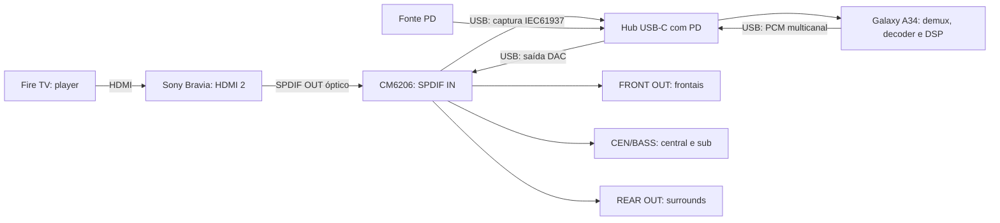

# Rota Fire TV, Bravia, CM6206 e Galaxy A34

Atualizado em 09/10/2026. **Estado: DSP em arquivos validado; rota óptica contínua ainda instável no PC; cadeia completa no A34 pendente.** Este relatório reúne requisitos, mapa e plano de implementação. Não é uma aprovação de funcionamento independente do PC.

## Montagem pretendida

O telefone assume captura, decodificação e processamento; a CM6206 converte o PCM processado nas saídas analógicas. A entrada e a saída USB trabalham simultaneamente na mesma placa. O hub precisa manter modo host e carregar o A34 nessa condição; presença de conector PD não comprova carga, compatibilidade ou estabilidade.

**Diferença da bancada atual:** Opera → VB-CABLE → encoder PC → HDMI/Sony → óptica → CM → decoder/DSP PC → USB/CM. O Fire TV substitui o player e o encoder do PC; o A34 substitui captura, decoder e DSP. A extensão do Opera não participa da montagem final.

## Configurações e materiais

- Fire TV na HDMI 2 da Bravia; o PC pode usar outra entrada apenas para diagnóstico. Não podem ocupar a mesma porta ao mesmo tempo.
- Bravia: **Sistema de áudio**, saída digital **Auto 1**, Dolby Digital Plus Out **Não**, conforme a condição que recebeu AC-3 válido nesta bancada. Usar a opção disponível no modelo, sem assumir transcoding de qualquer formato.
- Fire TV: selecionar uma opção de saída compatível com **Dolby Digital/AC-3**, quando disponível. Confirmar o formato efetivo recebido; a opção “Melhor disponível” pode negociar um formato diferente. Identificar geração/modelo e validar cada player.
- Óptica TV SPDIF OUT → CM SPDIF IN; cabo USB de dados CM → hub; hub → USB-C do A34; carregador/cabo PD adequados.
- Amplificadores e suas fontes próprias; FRONT, CEN/BASS e REAR ligados aos respectivos módulos. O hub não alimenta os amplificadores.
- A34 SM-A346M/Android 14, APK próprio, permissão USB e serviço foreground. ADB por cabo ou Wi-Fi serve à manutenção; não deve ser dependência do áudio final.

Um transporte óptico PCM comum tem dois canais. Se a TV decodificar 5.1 e entregar PCM estéreo, os canais originais já terão sido perdidos antes do A34. Gerar surrounds desse sinal é upmix, não recuperação do 5.1 original. E-AC-3 recebido por um player não prova que a TV transmitiu AC-3 na óptica; medir o que chega à CM.

## Canais: correção da inversão central/sub

Ordem lógica interna: **FL, FR, FC, LFE, SL, SR**. Trims, atrasos, EQ, medidores e WAV usam essa ordem.

| Teste isolado no PC | Resultado ouvido | Mapa confirmado nessa rota |
|---|---|---|
| Primeira fala, slot USB 2 (terceiro canal) | Central | FC → slot 2 |
| Segunda fala, slot USB 3 (quarto canal) | Subwoofer | LFE → slot 3 |

O usuário informou central ligada no R do módulo. Foi inicialmente aplicado swap FC/LFE a partir dessa descrição; **a fala central saiu no subwoofer**. O teste de duas falas isoladas confirmou o mapa acima. Logo, **no Windows testado, manter swap desligado**. Não inverter cabos ou canais com base somente em “L/R” escrito no amplificador: adaptador, fiação e driver também entram no mapa.

O APK possui a opção de swap, desligada por padrão. Ela troca apenas os slots enviados ao USB, depois do DSP; não muda WAV nem medidores lógicos. No A34, repetir teste de canais isolados com ganho baixo antes de aplicar qualquer inversão. Se FC sair no sub e LFE na central nessa rota, ativar swap e repetir; se o mapa normal estiver correto, mantê-lo desligado. Também fazer os ganhos físicos acompanharem o mapa correto.

O conector REAR ainda precisa de identificação definitiva. O protótipo Windows de oito canais duplicou surrounds em BL/BR e SL/SR. Isso fez parte do diagnóstico, não da arquitetura final. Priorizar seis canais de saída em captura/reprodução simultâneas e confirmar o par físico; não duplicar atrasos ou somar dois pares na mesma caixa.

## Atrasos solicitados e verificados

| Canal | Solicitação | Em 48 kHz | Valor efetivo |
|---|---:|---:|---:|
| FL / FR | 76,8 ms | 3.686 amostras | 76,7917 ms |
| FC | 5,8 ms | 278 amostras | 5,7917 ms |
| LFE | **5,8 ms** | **278 amostras** | 5,7917 ms |
| SL / SR | 71 ms | 3.408 amostras | 71 ms |

O usuário substituiu o atraso LFE antigo de zero por 5,8 ms. Teste PC em arquivo comparou o grafo ativo contra o mesmo grafo sem adelay: deslocamentos exatos nos oito slots, erro de comparação zero. Isso mede atraso digital relativo; não mede a latência total de Fire TV, TV, óptica, decoder, USB, amplificadores ou distância acústica.

A versão A34 **0.6.0/versionCode 6** foi compilada, instalada e instrumentada. Autoteste observou exatamente `3686,3686,278,278,3408,3408`. A operação debug aplicou esse vetor no **perfil salvo**, com backup anterior durável e confirmação de que nome, master, trims, EQ, cortes e demais ajustes foram preservados. O app não capturou/tocou a CM neste teste.

## Upmix, graves e volume

- **1/2 canais PCM realmente decodificados:** upmix configurável. Preencher caixas usa média central, surrounds reduzidas e LFE filtrado; Ambiência usa diferença L/R normalizada. Não é um decoder Dolby proprietário.
- **6 canais decodificados:** preservar cada posição; nunca decidir por silêncio/energia nos outros canais. Uma cena só nas frontais continua 5.1.
- **PCM/carrier IEC61937:** não interpretar palavras AC-3 encapsuladas como amplitudes de música. Demultiplexar e decodificar antes do DSP.
- Bass management: LR4 dos satélites, soma ao LFE antes dos delays, sem dupla cópia da central; subsônico LFE opcional; headroom conservador contando fontes e boosts do EQ.
- Limitar picos no domínio digital não garante que amplificador, fonte ou caixa suportem o volume. Calibrar ganhos por canal e margem com o conjunto real.

No PC, frontais distorciam em graves; o corte a 90 Hz melhorou a escuta. O ganho foi aumentado gradualmente: 0,02 → 0,10 → 0,12 → 0,24 → **0,30**, conforme pedidos do usuário. 0,24 com upmix e mapa normal teve confirmação auditiva de todas as caixas. O estado final óptico está em falha, portanto 0,30 é configuração salva, não garantia de reprodução atual.

O volume do mpv usa escala cúbica; o gerenciador converte ganho linear por `100*cbrt(ganho)`. Não copiar “30%” do Windows para o A34 ou multiplicar duas vezes o mesmo ganho. Evitar escrever volumes de hardware da CM durante ensaios; leituras/escritas de controle apresentaram falhas intermitentes.

No YouTube/Opera, o loopback pode mostrar seis slots mesmo para música estéreo. O núcleo antigo que fazia upmix por silêncio foi corrigido. Auto preserva entrada desconhecida; Stereo é override apenas de fonte confirmada. A extensão local usa a quantidade de canais na entrada de AudioWorklet antes do mixer: 1/2 → upmix, 6 → preservação. Passou 20 testes simulados, mas instalação/execução real no Opera continuam pendentes: Computer Use foi bloqueado por não confirmar a URL. Não contorna CORS/DRM nem faz passthrough de bitstream.

## O que já foi provado e o que falhou

1. Bancada anterior PC HDMI 2 → Sony → óptica → CM recebeu AC-3 de seis canais com CRC válido. Habilitar apenas REG2.DRIVERON desbloqueou as saídas analógicas. Isso afastou uma hipótese de bloqueio geral de Dolby nessa condição; serviços protegidos não foram testados.
2. Seis caixas foram ouvidas em testes USB. Central/sub tiveram o mapa normal confirmado por duas falas isoladas. O usuário confirmou upmix audível nas quatro categorias após a correção; não se concluiu calibração acústica definitiva.
3. Rota PCM sustentada funcionou, mas registrou travamentos de escrita de ~200 ms e frames descartados. Não está aprovada como sessão longa sem perdas.
4. Tentativas ópticas atuais tiveram captura ocupada, CRC inválido em alguns quadros, underruns e bloqueio de Reset/Start WASAPI. Após esse estado, HID também deixou de responder, exigindo reconexões. NVIDIA Broadcast usava um microfone da CM; foi encerrado temporariamente, sem prova conclusiva de causalidade.
5. O receptor conserva `crccheck+explode`: quadros inválidos são rejeitados e contabilizados, permitindo retomada nos válidos. Outros erros permanecem fatais. Isso não corrige CRC, relógios ou hardware; não chamar fluxo degradado de bit-perfect.
6. Saída óptica foi reduzida de oito slots para seis como próximo ensaio de duplex. **O último ensaio não chegou a abrir áudio por falha de controle HID.** Compatibilidade seis canais em arquivos passou; funcionamento dessa nova sessão física continua pendente.
7. Android: 27 casos JUnit, lint sem erros e instrumentação com `ok=true`; decoder Samsung perdeu 1.536 frames no fixture AC-3. O DSP foi comparado com mpv; o decoder continua experimental e sem aprovação de transparência/gapless.

## Plano para o A34 assumir o DSP

### 1. Fechar o transporte da bancada

Identificar causa dos travamentos sem desabilitar integridade: testar captura óptica isolada e duplex seis canais, registrar formatos/máscaras/USB, CRC, continuidade, reset/clock e filas. Confirmar mapa REAR e central/LFE. A rodada atual não autoriza migrar uma configuração instável como se estivesse pronta.

Critério: fluxo AC-3 conhecido com captura íntegra, saída seis canais, mapa ouvido e sessão contínua sem perdas recorrentes/reconexões. Separar problema do USB do que a TV transmite.

### 2. Inicialização USB/HID Android

Implementar adaptador real de `Cm6206AnalogDriver`, claim da interface HID sem tomar interfaces UAC, relatório correto por plataforma, leitura de registradores, journal persistente **antes** de DRIVERON e restauração que preserve demais bits. Não executar INIT/reset/EEPROM indiscriminados. Recuperar obrigações de journal depois de falha e reconexão, identificando a placa correspondente.

A base Java e os testes de guard existem; integração HID/journal no serviço ainda não está pronta. Uma configuração que anuncia seis/oito canais não prova roteamento analógico.

### 3. Captura óptica sem conversão PCM

Implementar backend do contrato `EncodedUsbAudioTransport`: selecionar interface/alternate setting/endpoints UAC reais, preservar words PCM16 carrier, tratar buffers/USB/drops e documentar clock. Se usar AudioRecord, demonstrar byte a byte que o caminho não aplica ganho/resampling/efeitos ao carrier; caso contrário usar transporte USB apropriado.

Sincronizar IEC61937, validar preâmbulos/tipo/comprimento/ordem de palavras e extrair quadros AC-3 com limites de buffer. Distinguir PCM estéreo de transporte codificado por estrutura validada e formato anunciado; não por energia. O serviço PCM atual não resolve isso.

### 4. Decoder controlado e decisão do modo

Avaliar decoder ARM64 baseado em FFmpeg/libavcodec ou alternativa de licença compatível. Registrar build/licenças e distribuir de modo adequado. Comparar duração, ganho, ordem e priming com referência; resolver a perda de 1.536 frames observada no codec Samsung antes de aceitá-lo como backend final.

Usar metadados do PCM produzido pelo decoder: mono/estéreo → upmix; 5.1 → preservar. Troca de formato limpa estados na fronteira adequada, sem deixar central/surrounds sintetizadas em uma fonte nativa. Formatos/layouts não suportados devem ficar explícitos. DD+/DTS não são suporte implícito por aceitar AC-3.

### 5. DSP, filas, relógios e saída

Reutilizar `DspEngine`: trims/master, crossover/headroom/EQ, atrasos solicitados e subsônico. Aplicar o mapa USB somente depois do DSP; WAV e medidores continuam lógicos. Confirmar se o HAL oferece seis posições corretas ou exige transporte USB próprio.

Usar pool/filas limitadas, métricas de captura/decoder/DSP/saída, recuperação de pausa e remoção, e parada que libere os streams antes de restaurar HID. Medir drift entre relógio óptico e DAC; implementar resampling adaptativo se necessário. Não transplantar a compensação PC 48.002→48.000 Hz: foi medida para outra cadeia.

### 6. Fire TV, alimentação e operação dedicada

Validar com Fire TV real: arquivo AC-3 local conhecido, música estéreo, mudanças entre formatos, pausa/seek e cada app usado. Confirmar que Bravia transmite o formato correto; conteúdo protegido exige teste próprio e não deve ser contornado.

Ensaiar hub PD, carga real, tela apagada, temperatura, várias horas, reconexão/queda de energia, arranque automático deliberado, USB permission e atualização do APK por Wi-Fi. Registrar latência ponta a ponta e repetir calibração acústica. O PC deve poder sair sem interromper o áudio quando a arquitetura estiver completa.

## Entregáveis de aceite

Perfil versionado com mapa e atrasos; APK assinado; dependências/licenças; guia de cabos/configurações; relatório de formatos/CRC/relógios; resultados em arquivos e escuta; recuperação de falhas; ensaio prolongado com hub; plano de manutenção e backup. Não publicar seriais ADB, credenciais, logs de conta ou capturas de mídia de terceiros.

Referências: [manual Sony usado na investigação](https://www.sony.com/electronics/support/res/manuals/W000/W0006624M.pdf), [CM6206](https://tehnoblog.org/downloads/cmedia/C-Media_CM-6206.pdf), [USB Android](https://developer.android.com/reference/android/hardware/usb/UsbDeviceConnection), [AudioFormat](https://developer.android.com/reference/android/media/AudioFormat), [WASAPI Initialize](https://learn.microsoft.com/pt-br/windows/win32/api/audioclient/nf-audioclient-iaudioclient-initialize), [relatório consolidado](PROGRESSO-A34-E-UPMIX-2026-10-09.md), [bancada PCM](PC-CM6206-PCM.md) e [receptor óptico](PC-CM6206-OPTICAL.md).

## Publicação e CI

### Diagnóstico adicional sem outro cabo USB

O usuário não dispõe de outro cabo USB nem de Fire TV para comparação imediata. Foi encontrado e corrigido um erro no leitor de diagnóstico Windows: FileStream usava buffer de 512 bytes para relatórios HID de cinco bytes. O leitor agora usa buffer 1, valida os tamanhos exatos 5/4 e seleciona somente a interface MI_03. Depois dessa mudança, seis registradores e captura óptica voltaram a responder sem nova reconexão física. Isso mostra uma contribuição de software; não prova que toda a instabilidade vinha desse buffer.

Captura isolada, sem saída DAC simultânea: 51.840 frames/207.360 bytes em 3,004 s, sem flag de descontinuidade. Foram encontrados 33 candidatos AC-3/48 kHz/seis canais/640 kbit/s: **13 CRC válidos e 20 inválidos**. Apenas cinco de 32 intervalos tiveram os 1.536 frames esperados. Ausência de flags WASAPI não comprovou continuidade ou integridade; a corrupção já aparece na captura isolada.

Após essa recuperação, a rota óptica com saída USB **seis canais** abriu e o relógio de reprodução avançou durante aproximadamente 30 s. Ainda acumulou CRC e encerrou após `invalid bitstream id`. Portanto o duplex de seis canais funciona nessa janela, mas não foi aprovado como fluxo contínuo íntegro.

Comparação com encoder PC de 448 kbit/s: a amostra recebida continuou anunciando **640 kbit/s**, teve 12 quadros candidatos completos, nenhum CRC válido e nenhum intervalo normal entre preâmbulos. O sinal recebido não foi uma cópia transparente do formato escolhido no encoder. Como as amostras não são uma captura simultânea antes/depois da TV, não se deve atribuir toda a corrupção à Bravia apenas por isso.

Foi acrescentado `KeepDeviceAlive` como opção diagnóstica, desligada por padrão, usando [audio-stream-silence do mpv](https://mpv.io/manual/stable/#options-audio-stream-silence) para reduzir Stop/Start em pausas. A rodada não resolveu a integridade e terminou sem nova aprovação de áudio. Próxima comparação preparada: loop físico CM SPDIF OUT → IN, com PCM sintético conhecido e amplificadores desligados, para separar TV e encoder do caminho USB/CM. A reprodução desse teste aguarda a mudança dos cabos e a autorização explícita do usuário.

Código e relatório publicados no GitHub. [CI Android](https://github.com/RafaelTerra-web/sistema-5.1-artesanal/actions/runs/37989271388) e [testes isolados](https://github.com/RafaelTerra-web/sistema-5.1-artesanal/actions/runs/37989271562) passaram. O ensaio adicional em arquivo da saída óptica de seis canais comparou 436.838 frames completos com a referência, erro máximo zero. Esses resultados não substituem a sessão física contínua, ainda bloqueada.
